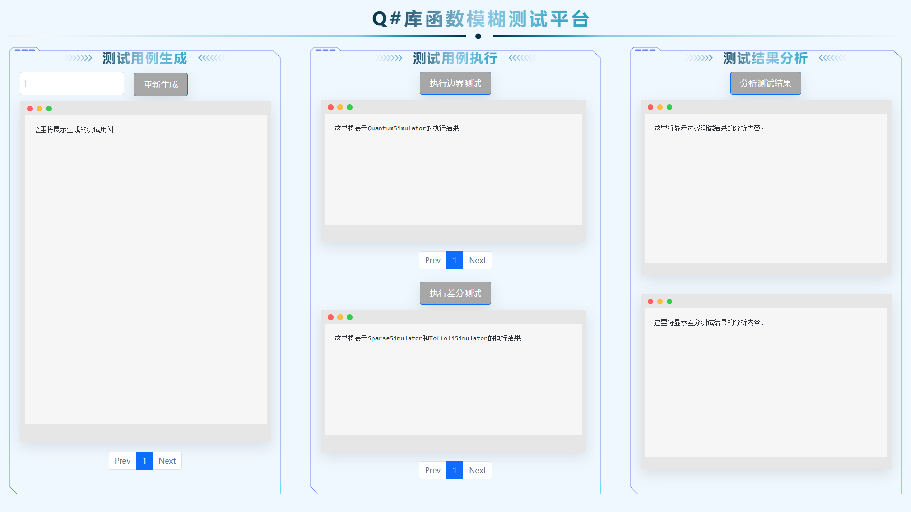

# 针对边界缺陷的 Q#库函数模糊测试系统 (updating)

## 系统使用方式1：网页

用户可通过http://upbeatsystem.s7.tunnelfrp.com访问测试系统。系统界面如下图所示。

**温馨提示：**边界测试和差分测试需要一定的执行时间，在提示“正在进行边界测试/正在进行差分测试”消失之前，请勿频繁点击。

## 系统使用方式2：源码

该测试系统源码可通过[仓库](https://github.com/NWU-NISL-Fuzzing/upbeat)获取。

## 理论支撑

该项目依托工作*Upbeat: Test Input Checks of Q# Quantum Libraries(ISSTA2024)*。
